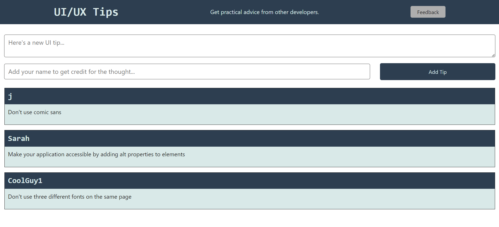

# ux-ui-tips 📝


## Description 📄

A full-stack application that uses HTML, CSS, and JavaScript for the frontend and Node.js with Express.js for the backend. Users can save and get suggestions for clever UX/UI design and feedback with this application, which effectively uses the GET and POST methods of the Fetch API to enable data interaction. It displays a comprehensive and thorough approach to user interaction and data management by methodically storing these insights in distinct JSON files and elegantly addressing incorrect entries by funneling them into a designated "diagnostics" file.

## Table of Contents

* [Installation](#installation) 🛠️
* [Usage](#usage) 📘
* [Contributing](#contributing) 🤝
* [Tests](#tests) 🧪
* [License](#license) 📜
* [Credits](#credits) 🙏
* [Questions](#questions) ❓
* [Deployed Application](#link) 🚀

## <a name="installation"></a>Installation 🛠️

To install the necessary dependencies, run the following command:

```
npm i
npm install express@4.16.4
npm install uuid@8.3.2
```

## <a name="usage"></a>Usage 📘

Users
- Users can easily enter their UX/UI suggestions on the home page for quick submission.
- The user experience is improved by the intelligent presentation of user-submitted tips at the bottom of the page.
- Users may easily access the feedback page, where they can easily give their insightful opinions and help improve the program, by selecting a handy option in the top-right corner of the screen.

Developers
- Must install visual studio code for development.
- NodeJS is used to create the backend of this application.
- ExpressJS dependency is used to create the server side and uuid dependency is used to give unique ID to saved data in JSON files.

Following is the screenshot of the application. 📷




## <a name="contributing"></a>Contribution 🤝

Contributing translations or internationalization support to make the application accessible to a broader audience.

## <a name="tests"></a>Tests 🧪

To run tests, run the following command:

```
node server.js
```

## <a name="license"></a>License 📜

This project is licensed under The MIT License. Here is the link to the license to access more information for your reference: [https://opensource.org/licenses/MIT](https://opensource.org/licenses/MIT)

## <a name="credits"></a>Credits 🙏

I utilized the study material provided by the institution as a reference to complete my application.

Following are the documents I used to help me write code:

- [Heroku documentation on getting started with Node.js](https://devcenter.heroku.com/articles/getting-started-with-nodejs?singlepage=true)
- [Heroku documentation on creating a Heroku remote](https://devcenter.heroku.com/articles/git#creating-a-heroku-remote)
- [Express.js documentation on express.Router](http://expressjs.com/en/guide/routing.html#express-router)
- [MDN Web Docs on using Fetch](https://developer.mozilla.org/en-US/docs/Web/API/Fetch_API/Using_Fetch)
- [Express.js documentation on req.body](http://expressjs.com/en/api.html#req.body)
- [Express.js documentation on serving static files](http://expressjs.com/en/starter/static-files.html)
- [Express.js documentation on query parameters](http://expressjs.com/en/guide/routing.html#route-paths)

## <a name="questions"></a>Questions ❓

If you have further questions, you are welcome to reach me through my email at hazkeel27@gmail.com.

You can view my projects by going through my GitHub profile at [https://github.com/hazkeel27](https://github.com/hazkeel27).

## <a name="link"></a>Deployed Application 🚀

